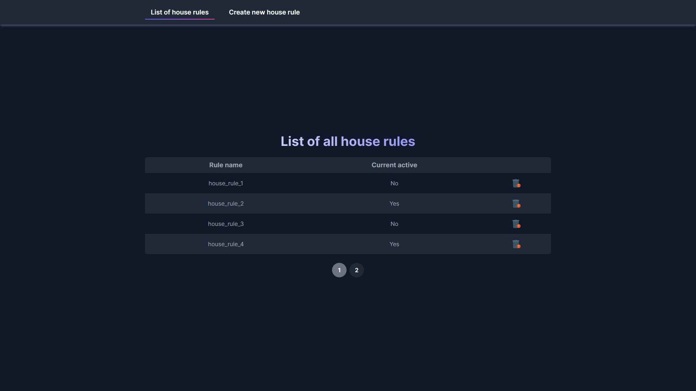

# Vagner Reis | Nuxt.js Task for [Search and Stay](https://agency.searchandstay.com/)

- <a href="#-about-the-project">About the project</a>
- <a href="#-install-guide">Installation guide</a>
- <a href="#-technologies">Technologies</a>

## About the project

- `Login page and error state`

<div style="margin-top: 16px; display: flex; gap: 12px; flex-wrap: wrap;" align='left'>
  
  
</div>

<br />

- `List and delete rules`

<div style="margin-top: 16px; display: flex; gap: 12px; flex-wrap: wrap;" align='left'>
  
  
  
</div>

<br />

- `Click on any rule to edit`

<div style="display: flex; gap: 12px; flex-wrap: wrap;" align='left'>
  
  
</div>

<br />

- `Create a new rule`

<div style="margin-top: 16px; display: grid; place-content: start; gap: 12px; flex-wrap: wrap;" align='left'>
  
</div>

<br />

## Install guide

```bash
# clone this repo
$ git clone git@github.com:vagnereix/sassdev-nuxt-task.git

# configure the environment variable
# copy the .env.template content to a new .env file
# set the content of NUXT_BASE_URL with the API endpoint: https://.../api/admin

# install dependencies
$ yarn

# serve with hot reload at localhost:3000
$ yarn dev

# build for production and launch server
$ yarn build
$ yarn start

# generate static project
$ yarn generate
```

## Technologies

- `Vue JS`
- `Nuxt.js`
  - Modules
    - `@nuxtjs/axios`
    - `@nuxtjs/tailwindcss`
    - `@nuxtjs/toast`
    - `cookie-universal-nuxt`
  - Middlewares
    - `auth`
